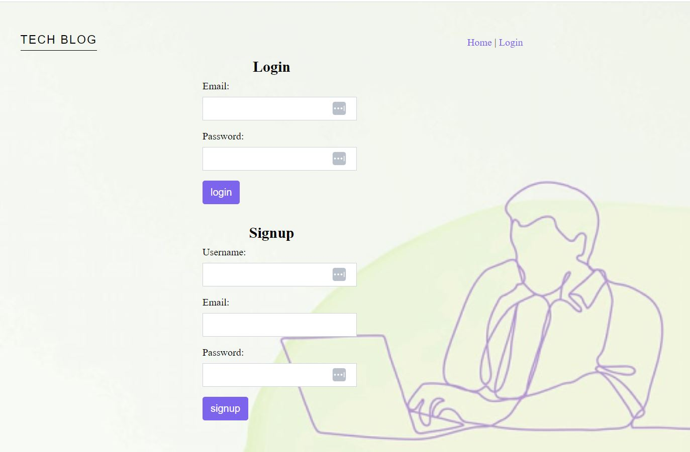

# 14 Model-View-Controller (MVC): Tech Blog

## Description

CMS-style blog site where developers can publish their blog posts and comment on other developers’ posts as well. This app follows the MVC paradigm in its architectural structure, using Handlebars.js as the templating language, Sequelize as the ORM, and the express-session npm package for authentication.

## Installation:
- npm i
- npm run seed
- npm start

## User Story

AS A developer who writes about tech
I WANT a CMS-style blog site
SO THAT I can publish articles, blog posts, and my thoughts and opinions

## Live URL 
[Visit the website:](https://secret-bayou-56501.herokuapp.com)

## Questions 
[Email me](mailto:saniyya.mcclendon@gmail.com)